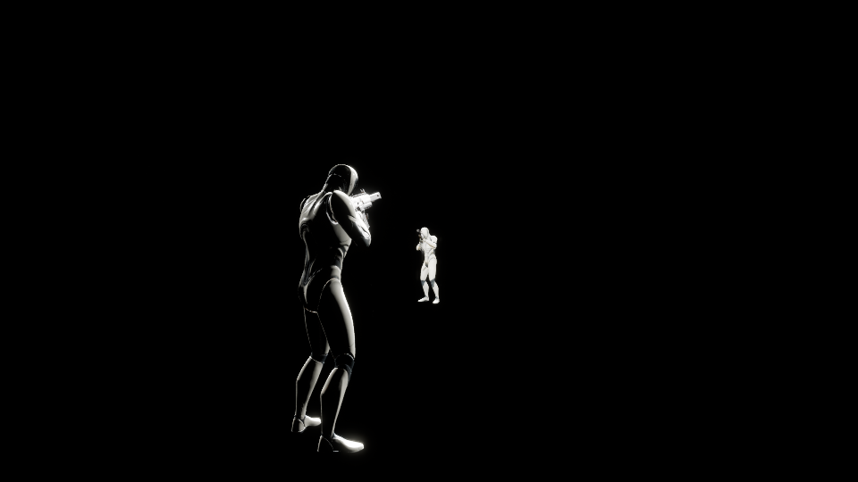
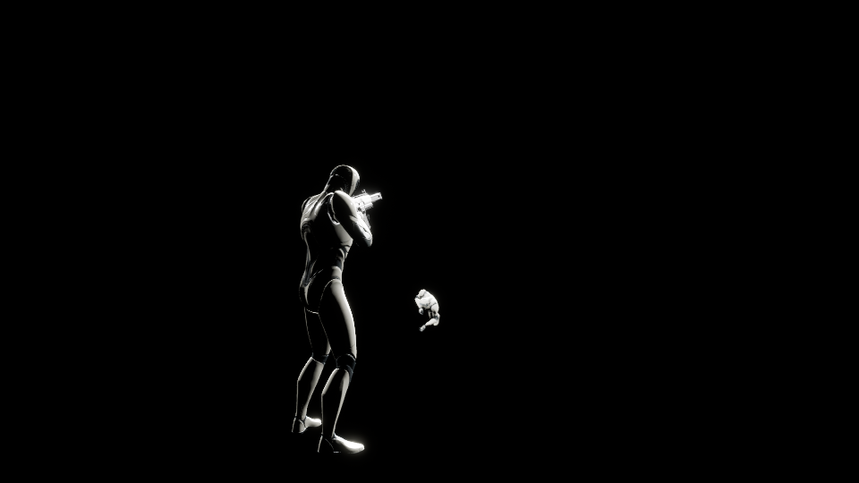

# 任务 18：GameplayCue、动画与战斗反馈

> 实施日期：2026-09-30。任务 18 完成；最终 Editor／Game 构建、资产验证、增强三进程专项、缺失媒体、有声渲染与相关回归均通过，观察者截图已复核。

## 目标与前置状态

任务 17 已提供两把武器、服务器射线与弹药结算、装填能力及死亡取消。本次在既有权威链路上加入拥有者即时开火表现、观察者射击与装填表现、服务器确认的命中／受伤反馈和基本死亡姿态，并验证 GameFeature 内容中的 GameplayCue 发现与撤销。血量、弹药、射速和命中结果仍由服务器处理；表现组件不能决定是否造成伤害。

## 事件与权威边界

`AMiniCharacter` 实现 `IGameplayCueInterface`，将收到的 Cue 转交 Pawn 自身的 `UMiniCombatFeedbackComponent`。PlayerState 上的 ASC 仍以当前 Pawn 为 Avatar，因此 Cue 可以沿既有 GAS 链路路由到角色。实战表现由原生接口处理；插件独立的 AssetProbe Cue 只用于验证资产发现，避免同一个战斗事件同时在原生组件和 CueNotify 中播放两次。

| Tag | 来源与行为 |
| --- | --- |
| `GameplayCue.Mini.RifleFire` | 拥有者请求开火时即时播放；服务器接受步枪请求后 Execute，同步给观察者 |
| `GameplayCue.Mini.PistolFire` | 与步枪使用同一确认链，播放手枪音效及武器 Montage |
| `GameplayCue.Mini.Impact` | 服务器枪口射线撞击表面后 Execute，播放撞击声和短暂亮光 |
| `GameplayCue.Mini.Damage` | 服务器成功应用伤害后，在目标 ASC 上 Execute，播放受伤声和红色亮光 |
| `GameplayCue.Mini.Death` | 服务器开始死亡时 Execute；复制死亡状态也恢复表现，每个 Pawn 只执行一次 |
| `GameplayCue.Mini.Reload` | 服务器装填能力 Add，结束或取消时 Remove；复制的活动 Cue 驱动装填 Montage |
| `GameplayCue.Mini.HitConfirmed` | 可靠 owner-only RPC 确认真实伤害后广播本地通知，供后续准星 HUD 使用 |
| `GameplayCue.Mini.AssetProbe` | `/MiniShooterCore` 中无特效 CueNotify 的扫描探针 Tag |

拥有者每次开火有独立 `ShotSequence`。本地在当前物品弹匣有弹时播放一次预测反馈并记住序号；服务器只对通过装备实例、物品 GUID、视角、射速及弹药检查的请求发出 Fire Cue。Cue 的 `RawMagnitude` 携带序号，拥有者收到同一序号时移除本地记录并抑制回声，观察者播放一次。组件另记最近收到的服务器序号，避免同一确认重复播放；记录上限为 64 项，在 Pawn 销毁时清空。当前射击 RPC 与 GAS 预测键没有共享，不依赖 GAS 自动处理开火去重。

即时枪声表示本地操作已经发生。服务器后来拒绝射击时不会产生权威命中、伤害和命中确认；已经播放的一次瞬时预测音效不会被追溯撤销。客户端临时射线也不能触发命中准星。

命中确认使用 `ClientNotifyHitConfirmed(ShotSequence, AppliedDamage, bKilled)`，只通知射手拥有者。反馈组件暴露 `OnHitConfirmed(ShotSequence, AppliedDamage, bKilled)` 给后续 HUD；通用 `OnCombatFeedback` 的 HitConfirmed Magnitude 始终为正的实际伤害，不用负伤害编码击杀。观察者可以接收 Impact／Damage Cue，但不会获得射手的 owner-only 命中通知。

## 资产与播放接口

六个复用音效为本机 Lyra UE 5.8 的独立 SoundWave，保留下面的原包路径。它们不需要整包 ShooterCore、原版音频调制图或 LyraGame 类。

| 用途 | UE 包路径 |
| --- | --- |
| 步枪开火 | `/Game/Audio/SoundWaves/Weapons/sfx_Weapon_AutoRifle_MainLayer_01` |
| 手枪开火 | `/Game/Audio/SoundWaves/Weapons/sfx_Weapon_Pistol_MainLayer_nl_01` |
| 表面撞击 | `/Game/Audio/SoundWaves/Weapons/SFX_BulletImpact_01` |
| 装填 | `/Game/Weapons/Rifle/Sounds/Rifle_Load01` |
| 受伤 | `/Game/Audio/Sounds/Impacts/Lyra_Plyr_BulletImpact_01` |
| 死亡 | `/Game/Audio/Sounds/Impacts/Lyra_EnemyKilled_01` |

两把枪暂时共用简短装填声。声音通过 `SpawnSoundAtLocation` 播放，使用自动销毁的一次性音频组件；专用服务器跳过媒体播放。反馈默认引用是软引用，小型首版首次使用时同步加载；若需降低首次播放加载尖峰，可在后续资源优化时纳入 Experience 预加载。

武器动画全部使用 Mini 目录下的对应武器骨架与 `DefaultSlot`。

| 武器 | AnimBP | 开火 Montage | 装填 Montage |
| --- | --- | --- | --- |
| 步枪 | `/Game/Mini/Weapons/Rifle/Animations/ABP_MiniRifleWeapon` | `/Game/Mini/Weapons/Rifle/Animations/AM_MiniRifle_Fire` | `/Game/Mini/Weapons/Rifle/Animations/AM_MiniRifle_Reload` |
| 手枪 | `/Game/Mini/Weapons/Pistol/Animations/ABP_MiniPistolWeapon` | `/Game/Mini/Weapons/Pistol/Animations/AM_MiniPistol_Fire` | `/Game/Mini/Weapons/Pistol/Animations/AM_MiniPistol_Reload` |

每个 Montage 分别引用同目录的 `Weap_Rifle_Fire`、`Weap_Rifle_Reload`、`Weap_Pistol_Fire` 或 `Weap_Pistol_Reload` 序列。装填序列从 Lyra 独立迁移并重新保存为 Mini 骨架引用，未将 Fire 序列假作 Reload。装备定义新增 `WeaponAnimClass`；`RefreshEquipmentAppearance` 在切换网格后设置对应武器 AnimBP。反馈组件取得当前武器的 AnimInstance，验证 Montage 骨架与当前网格相同后调用 `Montage_Play`，避免跨 Actor 通道延迟 Cue 在新武器上播放旧武器动画。

角色的 `/Game/Mini/Characters/Mannequins/Anims/ABP_MiniPractice` 在原移动图输出后加入 `DefaultSlot`，保留任务 11 的站立、奔跑及跳跃图。本次实战 Montage 在武器网格上播放；人体 Slot 为后续角色动作留出接入位置，当前没有迁入完整人体开火／装填动作库、动画层或 IK 系统。

枪口、命中与受伤用短暂 PointLight 表达，约 0.08 秒后销毁，关闭阴影。死亡采用网格侧倾与下移的简单姿态，并由既有 HealthComponent 禁止移动、输入和碰撞；本次没有布娃娃或完整死亡动画。临时本地射线可通过 `mini.Weapon.LocalTracer` 关闭，权威调试射线由 `mini.Weapon.DrawTraces` 控制。

## 装填、死亡和退出的回收

装填能力成功建立 `State.Reloading` 效果后 Add Reload Cue，参数携带来源装备实例与枪种。表现只从活动 Cue 的 `WhileActive` 开始；单独收到 `OnActive` 不足以启动，避免同帧开始并取消后留下没有活动条目对应的装填动画。

装备复制与 ASC Cue 复制可能先后到达。只有当前装备与 Cue 来源相同才开始装填；外观刷新和初始化依赖变化后再尝试 `RefreshPendingReload`。UE 的活动 Cue 在来源对象延迟映射时不会再次广播 `WhileActive`，因此 MiniASC 提供只读查询，组件以短时定时器重读当前条目的参数，直到来源与装备匹配或条目已撤销。Removed 清除待处理来源和重试定时器并停止 Montage。切枪先停止旧动画，再安装新网格／AnimBP；死亡先停止装填，复制的死亡状态与瞬时 Death Cue 共用一次性保护。

能力 `EndAbility` 清理服务器计时器、Remove Reload Cue 和移除装填效果；完成、切枪、死亡、强制能力撤销都经过这条收尾链。补弹仍只由服务器计时器执行且重新检查来源装备，停止表现不改变弹药。反馈组件 `EndPlay` 停止装填并清空序号记录，销毁尚存的灯光；灯光定时器采用弱绑定，组件销毁后不访问失效对象。装填声为一次性短音效，没有持续循环音频需要额外停止。

## GameFeature Cue 路径

`/MiniShooterCore/GameFeatureData` 加入唯一的 `MiniTask18_AddGameplayCuePath` Action，原生类为 `UMiniGameFeatureAction_AddGameplayCuePath`。激活时插件内容已挂载，Action 调用 `AddGameplayCueNotifyPath("/MiniShooterCore/GameplayCues", true)` 并重新扫描。CueManager 是进程级对象，因此 Action 对路径维护引用计数，多个 World／PIE 上下文共用路径；最后一个引用解除时才调用 `RemoveGameplayCueNotifyPath(..., true)`，Unregistering 也防御性回收剩余上下文。

测试资产 `/MiniShooterCore/GameplayCues/GC_Mini_AssetProbe` 是无特效 GameplayCueNotify 静态蓝图，Tag 在 `Config/DefaultGameplayTags.ini` 注册。路径专项检查激活前、激活后和撤销后的路径／CueSet 状态，证明插件扫描确实增加并移除 Cue 条目。此测试资产不承担实战音效，也不会叠加战斗特效。

## 重建与验收命令

在 `F:\FPS\FPS` 的 PowerShell 执行：

```powershell
.\Scripts\BuildProject.ps1 -Target FPSEditor
.\Scripts\BuildProject.ps1 -Target FPS
.\Scripts\Task18CueAssets.ps1
.\Scripts\Task18AnimationAssets.ps1
.\Scripts\VerifyTask18CuePath.ps1
.\Scripts\VerifyTask18.ps1
.\Scripts\VerifyTask18.ps1 -NoMediaAssets
.\Scripts\VerifyTask18.ps1 -WithMedia
```

资产已经提交时不必每次重建。`Task18CueAssets.ps1` 与 `Task18AnimationAssets.ps1` 包含创建和新 Editor 进程验证；PythonScriptPlugin 由这些编辑器命令临时启用，不需要下载额外插件。动画检查同时核对人体移动图、Slot、四个 Montage 轨道、骨架和过期 `/Game/Weapons`／`/Script/LyraGame` 依赖。仅在缺少两条 Mini 装填序列的重新搭建流程中，先运行 `Task18MigrateWeaponReload.ps1`；该脚本需要 `F:\LyraStarterGame`，并会拒绝覆盖现存序列。

`VerifyTask18.ps1` 启动训练图监听服务器和两个独立拥有者客户端，核验射手的预测／确认／回声抑制计数、观察者射击、真实命中确认、受伤与撞击、装填开始、切枪取消、同帧快速取消无孤立 Cue、再次装填恢复及死亡清理。脚本检查三份日志中的阶段顺序，并在结束时关闭自己启动的进程。

默认 `-nullrhi -nosound` 专项证明复制、事件和权威伤害，不证明肉眼或听觉体验。`-NoMediaAssets` 清空反馈组件的声音／Montage 引用，要求声音和动画播放计数为零但 25 伤害与死亡仍正确。`-WithMedia` 让两个客户端启用渲染和声音，检查成功播放计数并保存两端的 Reload／Death 截图到 `Saved/Screenshots/Task18-Owner1-Reload.png` 等四个文件。运行时也录制两端的 AudioMixer master mix，输出 `Saved/Task18Audio/Task18-Owner1-Combat.wav` 和 `Task18-Owner2-Combat.wav`；`Scripts/Task18InspectAudio.py` 检查实际导出的 16-bit PCM 时长、峰值和 RMS，确保有非静音音频数据。探针仅在媒体测试模式下将失去焦点的进程音量设为 1，避免隐藏自动化窗口被引擎静音；不改变普通游戏的音量策略。截图仍需实际检查；录音验证音频实际输出，但音色、空间定位和音量平衡的体验评价仍需人工试听。

## 当前验证记录

| 验证项 | 截至本稿的证据与状态 |
| --- | --- |
| Editor Win64 Development 构建 | 最终实现构建已通过，结果 `Succeeded` |
| Game Win64 Development 构建 | 最终实现构建已通过，结果 `Succeeded` |
| Cue 资产幂等创建与独立验证 | 已通过；`Saved/Logs/Task18-VerifyCueAssets.log` 的 `MINI_TASK18_CUE_ASSETS_VERIFIED` |
| Cue 激活／撤销 | 已通过；`Saved/Logs/Task18-CuePathLifecycle.log` 的 `MiniTask18CuePath RESULT: PASS` |
| 动画资产幂等创建与独立验证 | 已通过；`Saved/Logs/Task18-AnimationVerify.log` 的 `MINI_TASK18_ANIMATION_ASSETS_VERIFIED Slot=DefaultSlot Montages=4` |
| 增强三进程专项 | 已通过；SERVER_PASS 包含 RapidCancel／ReloadRecovered／DeathReloadCancel；射手 Predicted=1、Presented=1、Confirmed=1、Suppressed=1，观察者 Presented=1、Confirmed=1、HitConfirm=0；两端快速取消 Orphan=0、死亡 ReloadStop=2 |
| `-NoMediaAssets` 伤害独立性 | 已通过；两端确认 Sounds=0、Montages=0、Damage=25、Death=1，反馈媒体缺失仍不影响权威结算 |
| `-WithMedia` 渲染和音频输出 | 已通过；成功播放计数、四张渲染截图和两份 master mix WAV 均生成；双声道 48 kHz，约 2.3 秒，峰值 32763，两端 RMS 约 4220／4261 |
| 截图视觉检查 | 补光后重跑并复核，观察者可清晰看见目标枪械和死亡姿态；证据为下方两张图片 |
| 相关旧任务回归 | 任务 11／15／16／17 均通过；任务 16 旧探针的移动／视角同步修补后重新通过 |

任务 16 旧探针用 `DisableMovement` 进入 `MOVE_None`，会冻结上传拥有者控制朝向的移动复制链；同时校正相机后立即按键，射击 RPC 可能先于新朝向到达。该探针现保持 `MOVE_Flying` 并停止速度，将相机校正和开火分帧，等待完整 0.45 秒再按键。修补只改变自动化场景的同步方式，正式 `ServerFire` 的装备、视角、射速、弹药和伤害校验没有放宽；修补后的任务 16 回归已经通过。

以下截图来自观察者客户端。探针将两名角色移到高空隔离碰撞，并添加测试补光，因此黑色背景是专项探针环境，不代表训练图的实际场景效果。





完整日志在本机 `Saved/Logs`，录音和原始截图在 `Saved` 下；选出的两张观察者截图随本任务文档保存。任务 19 尚未开始活动实现，可从明确的 `OnHitConfirmed` 与 `OnCombatFeedback` 事件接入准星和 HUD，按 Widget 生命周期绑定并撤销委托。
