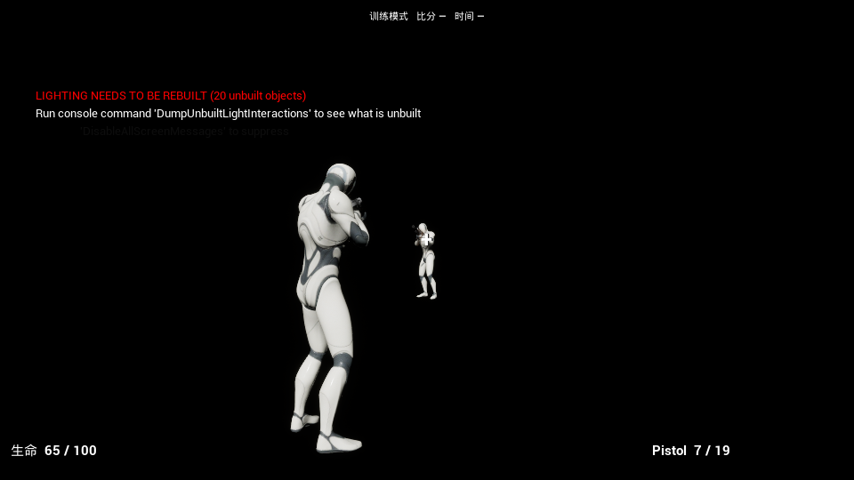
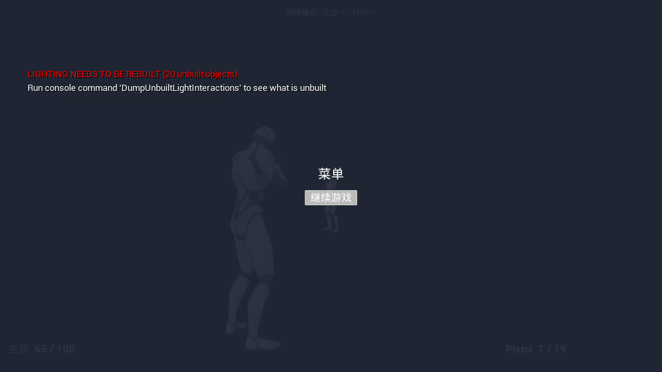
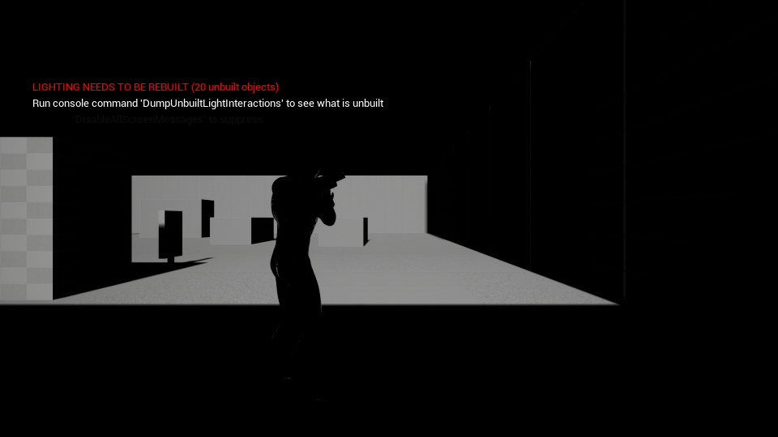
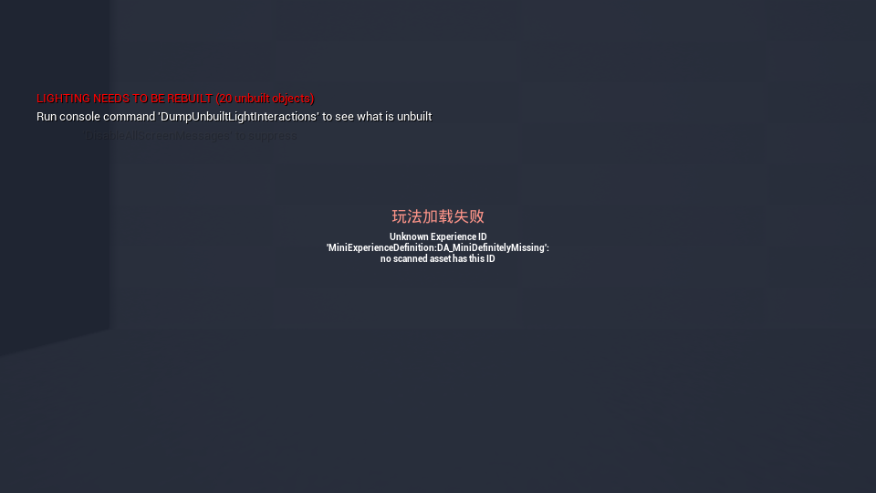

# 任务 19：本地消息、CommonUI 层栈与模块化 HUD

> 最终验证日期：2026-10-01。任务 19 实现与验收完成：最终 Editor／Game 统一编译、资产三阶段、补强后的三进程默认／媒体专项、双端加载／错误专项及相关回归均通过，十张截图已复核。单项提交推送由本次收尾执行。

## 目标与前置状态

任务 18 已提供服务器确认的伤害、拥有者命中 RPC、两把武器的装备与弹药复制、死亡与重生。本次将这些状态接入本地 UI：每个 LocalPlayer 拥有一个 CommonGame 根布局，MiniShooterCore 在根布局的 Game 层注入战斗 HUD，并向四个 UIExtension 插槽注册血量、弹药、准星和比赛占位 Widget。菜单与加载界面负责本地输入门控；撤销玩法 UI 时主动释放监听和输入捕获。

本次 HUD 是原生 UMG／CommonUI Widget，根布局和 HUD 的 WidgetTree 在 C++ 中建立。资产层只需一个 UI Policy 蓝图和 MiniShooterCore 的 AddWidgets Action 配置，不迁入原版 Lyra 的整套 UI 蓝图、字体和图标依赖。比分、计时仍是占位数据，真实比赛复制数据在任务 21／22 接入；前端与连接失败后的产品流程在任务 24 完成。

## 权威状态与本地消息

`UGameplayMessageSubsystem` 是 GameInstance 中的本地消息路由器。它不把广播发送到服务器或其他客户端，也不能用来结算伤害、弹药、死亡或比赛分数。HUD 的数据先通过原有属性／库存／装备复制和必要 RPC 到达当前进程，再由 `UMiniHUDViewModel` 读取当前状态并广播本地通知。

| 数据 | 权威来源 | 本地桥接 |
| --- | --- | --- |
| 生命／最大生命 | PlayerState ASC 的 `UMiniHealthSet` | 属性变化委托；要求 ASC 的 Avatar 仍是本地 Pawn |
| 死亡／装填 | ASC 上的 `State.Dead`／`State.Reloading`；HealthComponent 的死亡状态 | ASC Tag 委托与当前快照 |
| 武器／槽位／弹药 | 拥有者 Controller 的 QuickBar、Inventory 及 Item 子对象 | QuickBar／Inventory／Item 的 `OnChanged` 与复制通知 |
| 命中标记 | 服务器实际造成伤害后调用 owner-only `ClientNotifyHitConfirmed` | 任务 18 FeedbackComponent 的 `OnHitConfirmed`；HUD 不做客户端射线命中推断 |
| 空弹匣提示 | 服务器拒绝无弹射击后调用 owner-only 通知 | RangedWeaponComponent 的 `OnEmptyMagazine`，校验当前物品 GUID |
| 比分／时间 | 尚无本任务权威数据 | `bHasMatchData=false`，显示破折号，不显示虚构的实时比分 |

`FMiniHUDSnapshot` 保存 LocalPlayer、World、Pawn、物品 GUID、武器名、生命、槽位、弹药和可用性标记。没有完成复制的对象显示“同步中”，不会将缺失属性的零值解释为死亡。ViewModel 比较有效数据，只有快照发生变化才提高 Revision 并广播，避免每帧刷新相同文本。

| Tag | 消息结构 | 用途 |
| --- | --- | --- |
| `Mini.Message.HUD.StateChanged` | `FMiniHUDStateMessage` | 当前本地状态变化 |
| `Mini.Message.HUD.HitConfirmed` | `FMiniHUDHitMessage` | 已确认命中；携带序号、正的实际伤害、击杀标记 |
| `Mini.Message.HUD.EmptyMagazine` | `FMiniHUDEmptyMessage` | 当前物品的空弹匣通知 |

每条消息同时携带 ViewModel Source、LocalPlayer 和 World。Widget 必须匹配这三个值；命中另要求 Pawn 相同，空弹匣另要求 ItemId 相同。这些过滤防止同一 GameInstance 的旧 World／其他 UI 实例接收当前玩家的通知。不同客户端进程仍各自拥有路由器，消息本身不具备网络复制功能。

## 初始快照、迟到复制与重生

HUDLayout 激活时先启动自己的 ViewModel，再注册 LocalPlayer 上下文的 UIExtension 插槽。新增 Widget 在加入面板前设置 ViewModel；其 `StartListening` 先读取 `GetSnapshot()` 并渲染，再注册本地消息监听。因此 HUD 晚创建时即使以后没有变化，也能显示已经存在的生命和弹药。

ViewModel 先注册 CommonLocalPlayer 的 Controller／PlayerState／Pawn 生命周期委托，再读取已经存在的对象。Controller 改为 `ACommonPlayerController`，继续保留 ModularGameplay 基础，并提供 CommonGame 的标准生命周期通知。对象变化后 `RebindSources` 先移除旧对象委托，再绑定新的 Controller、Pawn、PlayerState ASC、库存、QuickBar、当前 Item、反馈和武器组件；PawnExtension 的 DataInitialized 通知触发快照刷新，避免初次绑定时 ASC Avatar 尚未就位。

Item 的 GUID、Definition、Stats 与 QuickBar 的槽位可能跨复制通知先后到达。库存 FastArray 的变化、Item 的 `OnRep_ItemData` 以及权威端 `SetStat`／初始化变化都会广播 `OnChanged`，并由 Item 继续通知 Inventory。因此槽位先到而物品子对象后来才可识别时，ViewModel 可以重新查找当前 Item；监听不会只停留在最初的空槽快照。Listen Server 没有依靠客户端 OnRep 更新自身 HUD，权威数据变更也会发出同样的本地通知。

死亡后快照隐藏准星并显示阵亡；重生的 CommonLocalPlayer Pawn 通知将 ViewModel 重新绑定到新 Avatar。旧 ViewModel 和 Widget 被撤销时清空快照中的 World／Pawn 引用。停止监听的旧 Widget 即使因 CommonUI 池化或验证保留仍未销毁，也不得继续接收消息。

## 根布局、层栈与玩法注入

`UMiniGameUIPolicy` 由 CommonGame 管理 LocalPlayer 的 `UMiniPrimaryGameLayout`。根布局是基础 UI 生命周期的一部分；MiniShooterCore 只拥有自己的 HUD 与插槽内容。插件停用时，基础根布局和加载／错误状态可以继续存在。

| Layer Tag | 内容与输入 |
| --- | --- |
| `UI.Layer.Game` | 基础 Game 输入 fallback；玩法插件推入 `UMiniHUDLayout` |
| `UI.Layer.Menu` | `UMiniDebugMenuWidget`；Esc 打开，继续按钮／Esc 关闭 |
| `UI.Layer.Modal` | 已建立空层，供后续模态对话框使用 |

根布局完成 WidgetTree、层栈注册并加入 viewport 后才标记 `IsLayoutReady` 并广播 `OnRootLayoutReady`。从 viewport 移除或释放时广播 `OnRootLayoutUnavailable`；NativeDestruct 提前发出通知，避免在子层已经清理以后才让 Action 撤销贡献。Policy 用当前 LocalPlayer／Root 记录去重，同一次撤销不重复处理。

`UMiniGameFeatureAction_AddWidgets` 按激活上下文、World 和 HUD 跟踪贡献，只处理当前 World 的本地 Controller／LocalPlayer。ModularGameplay HUD 扩展接收者事件和 Policy Ready 事件共同触发注入，既支持功能先到，也支持根布局或 HUD 后到，不使用固定 Delay 假定 UI 就绪。

Action 为请求的软 Widget 类建立异步加载句柄；完成回调同时校验激活上下文、World、HUD 和 Generation。HUD 移除、根布局不可用、World cleanup、插件停用和 Unregistering 都会撤销属于自己的贡献并取消加载。安装 Widget 可能触发重入，Action 在安装以后重新查找跟踪记录，若已撤销则立即移除刚安装的 Widget。相同 LocalPlayer 的新 HUD 替换旧 HUD 时，先撤销旧贡献。

| UIExtension Tag | 原生 Widget | 显示 |
| --- | --- | --- |
| `UI.HUD.Health` | `UMiniHUDHealthWidget` | 左下生命／最大生命／阵亡状态 |
| `UI.HUD.Ammo` | `UMiniHUDAmmoWidget` | 右下武器、弹匣／备用弹药、装填或空弹匣提示 |
| `UI.HUD.Crosshair` | `UMiniHUDCrosshairWidget` | 屏幕中央准星；确认命中短时显示 ×，击杀用红色 |
| `UI.HUD.Match` | `UMiniHUDMatchWidget` | 顶部训练模式、比分／时间占位 |

插槽和扩展均以 LocalPlayer 作为 ContextObject，ExactMatch 匹配 Tag。准星的 Canvas slot 使用内容自动大小，标记中心与相机屏幕中心射线相同。命中标记约 0.18 秒的定时器只控制表现持续时间，不参与服务器命中计算。

空弹匣 owner RPC 可能早于私有 Controller 的弹药复制，Ammo Widget 保留待处理的物品通知，等观察到弹匣零值才显示空弹匣提示。切枪、装填、死亡、补弹或停止监听会清除提示，避免 RPC 与弹药复制不同步造成错误的正弹药空弹匣提示。

## 菜单、加载与输入回收

`UMiniActivatableWidget` 为 CommonUI 返回 Game／Menu／All 输入配置。Menu 或显式需要阻断的 Widget 激活时，向所属根布局登记一个输入门控来源；停用和 NativeDestruct 都移除自己的登记。根布局按来源集合计算是否阻断，不由某个菜单无条件覆盖其他加载或菜单来源。

`UMiniUIManagerSubsystem` 将根布局的门控变化同步到本地 `AMiniPlayerController::SetMiniUIInputBlocked`。Controller 保留独立的既有玩法输入门控，`IsMiniInputBlocked` 汇总两者；进入菜单立即清空 ASC 按住输入，并令 Hero 回收输入映射／绑定。菜单关闭后只在其他门控解除、Pawn 未死亡且初始化允许时恢复，释放菜单不应激活已经死亡的 Pawn。Game 层 fallback 在插件 HUD 撤销后仍提供基础 Game 输入配置。

`UMiniLoadingStatusWidget` 属于根布局，显示等待 GameState、加载资源／功能、初始化、退出或明确的失败原因。当前 Experience API 没有可移除的状态变化委托，Widget 使用 Core Ticker 读取实时状态，到 Loaded／Failed 就停止 Ticker。GameStateSet 和 WorldCleanup 使用明确委托句柄；根布局撤销时停止监控并移除门控。加载失败界面是调试状态展示，尚未包含任务 24 的前端返回和重试流程。

| 注册／资源 | 释放位置 |
| --- | --- |
| Policy Ready／Unavailable 委托 | AddWidgets 的 ResetWorld；UIManager 的 Deinitialize |
| HUD 扩展接收者与 World 生命周期委托 | AddWidgets 的 ResetWorld／ResetContext |
| Widget 类异步加载句柄 | ResetHUD 先使 Generation 失效，再 CancelHandle、ReleaseHandle |
| Action 的 UIExtension 注册 | RemoveWidgets；先 Unregister 扩展，再撤销布局 |
| HUDLayout 的四个 ExtensionPoint | ClearGameplayUI，NativeOnDeactivated／NativeDestruct 共用 |
| ViewModel 的属性、Tag、对象和生命周期委托 | Stop／UnbindSources；BeginDestroy 作防御性回收 |
| Widget 的 GameplayMessage 监听 | StopListening；在扩展移除及布局停用时显式调用，不等待 GC |
| 命中标记定时器 | CrosshairWidget 的 OnStoppedListening |
| 调试菜单输入、按钮委托 | ActivatableWidget 停用／销毁；HUDLayout CloseDebugMenu；菜单 NativeDestruct |
| 加载 Ticker／World 委托／输入门控 | LoadingStatus StopMonitoring |
| UIManager 的 LocalPlayer／Root／Controller 绑定 | UntrackPlayer、RootUnavailable 和 Deinitialize |

## 资产与工程配置

`/Game/Mini/UI/B_MiniUIPolicy` 是 `UMiniGameUIPolicy` 的普通 Blueprint；其 `LayoutClass` 默认值指向 `/Script/FPS.MiniPrimaryGameLayout`。CommonGame 的该属性在原生代码中为 private，但允许资产编辑；任务 19 的编辑器桥接仅在编译并保存 Policy 蓝图时设置默认值，运行时不改写 Policy CDO。

`/MiniShooterCore/GameFeatureData` 配置唯一 `MiniTask19_AddWidgets` Action：向 Game 层安装一个 `UMiniHUDLayout`，并向四个 HUD Tag 各注册一个对应原生 Widget，优先级 0。制作脚本保留其他系统的 Actions，发现第二个 AddWidgets owner 或同名错误类时拒绝修改，避免重复 HUD。

配置与依赖：

- `Config/DefaultGame.ini` 的 `[/Script/FPS.MiniUIManagerSubsystem]` 将 `DefaultUIPolicyClass` 指向 `B_MiniUIPolicy_C`。
- `Config/DefaultEngine.ini` 将 `GameViewportClientClassName` 设为 `/Script/CommonUI.CommonGameViewportClient`。
- `FPS.Build.cs` 添加 CommonUI、CommonInput、UMG、UIExtension、GameplayMessageRuntime 及 Slate／SlateCore 依赖。
- 使用工程已经启用的 CommonGame／CommonUI／UIExtension／GameplayMessageRouter，不需要安装新的 Marketplace 插件。制作脚本通过命令临时启用引擎自带 PythonScriptPlugin。

## 重建与运行命令

从 `F:\FPS\FPS` 的 PowerShell 执行；下列构建与专项已经实际通过：

```powershell
.\Scripts\BuildProject.ps1 -Target FPSEditor -DisableAdaptiveUnity
.\Scripts\BuildProject.ps1 -Target FPS -DisableAdaptiveUnity
.\Scripts\Task19Assets.ps1
.\Scripts\VerifyTask19.ps1
.\Scripts\VerifyTask19.ps1 -WithMedia
.\Scripts\VerifyTask19Loading.ps1
.\Scripts\VerifyTask19Loading.ps1 -WithMedia
```

`Task19Assets.ps1` 先用两个独立 Editor 进程重复制作 Policy 和 GFD Action，再用第三个进程只读验证已保存的类型、父类、编译状态、根布局、四个元素和过期 Lyra UI 依赖。日志为 `Saved/Logs/Task19-{Create,CreateAgain,Verify}Assets.log`。

`VerifyTask19.ps1` 使用训练图的真实 Listen Server 和两个独立客户端，已覆盖主机本地 HUD 与权威端同步刷新、客户端各自快照、射手命中与观察者隔离、换枪、撤销 HUD 后修改状态、晚创建 HUD 恢复当前数据、CommonUI 菜单实际阻断／恢复、根布局真实释放／重建、死亡／重生重新绑定，以及通过 GameFeaturesSubsystem 真正停用 MiniShooterCore 后的 Widget／ViewModel／监听／加载／输入清理。插件停用后再次真实重建根布局，主机和客户端均确认 viewport 中根布局有效但 HUD 数、Action 贡献和输入门控仍为零。局部 `SetProbeSuspended` 只用于中途的晚创建 HUD 场景，最终清理由真实插件停用验证。

默认 `-nullrhi -nosound` 检查生命周期与数据，不证明可见布局。`-WithMedia` 为两端保存 HUD、Menu、FeatureOff 六张截图，路径为 `Saved/Screenshots/Task19-Owner{1,2}-{HUD,Menu,FeatureOff}.png`；最终六图已逐张复核，中文、准星中心、面板和撤销显示均正常。默认日志为 `Saved/Logs/Task19-{Server,ClientA,ClientB}.log`，媒体日志独立保存为 `Task19-WithMedia-{Server,ClientA,ClientB}.log`，不会互相覆盖。

`VerifyTask19Loading.ps1` 单独以 Listen Server＋一个客户端覆盖有效和未知 Experience：检查真实挂接的 LoadingStatusWidget 的可见性、标题、失败原文、根布局与 Controller 门控和状态 Ticker 停止。它不依赖战斗 HUD 安装成功才能显示错误；`-WithMedia` 请求包含 UI 的实际截图。默认与媒体两种模式均实际 PASS：Loaded 两端无 overlay、门控为零、Ticker 已停；Failed 两端显示失败标题和精确原因、保持输入阻断、Ticker 已停。日志为 `Saved/Logs/Task19-Loading-[WithMedia-]{Valid,Invalid}-{Server,Client}.log`，四张截图为 `Saved/Screenshots/Task19-Loading-{Loaded,Failed}-{ListenServer,Client}.png`，已全部复核。

也可直接启动训练图进行交互检查：

```powershell
& 'C:\Program Files\Epic Games\UE_5.8\Engine\Binaries\Win64\UnrealEditor.exe' `
    'F:\FPS\FPS\FPS.uproject' '/Game/Mini/Maps/L_MiniPractice' -game -windowed
```

进入后 Esc 打开调试菜单，点“继续游戏”或按 Esc 返回；战斗输入沿已有 InputConfig 执行。最终独立 Cook 的训练流程和打包烟测属于任务 20，任务 19 的未 Cook 测试不能代替它。

## 当前验证记录

| 验证项 | 2026-10-01 的实际结果 |
| --- | --- |
| 最终 Editor Development 构建 | 补强后统一编译成功，使用 `-DisableAdaptiveUnity` |
| 最终 Game Development 构建 | 补强后统一编译成功，使用 `-DisableAdaptiveUnity` |
| 资产幂等制作／新进程只读验证 | Create／CreateAgain／Verify 三阶段实际通过；保存的 Policy 默认值与唯一 AddWidgets／四元素配置均验证通过 |
| 无渲染三进程 HUD 生命周期专项 | 补强后重跑 PASS，包含主机权威刷新、根布局释放／重建、插件停用后重建根布局且 HUD／Action／门控为零 |
| 有渲染专项与截图复核 | 补强后 `-WithMedia` 重跑 PASS，最终六张 HUD／Menu／FeatureOff 截图已逐张复核 |
| 加载／错误调试界面 | 默认及 `-WithMedia` 的有效／未知 ID 双端专项均 PASS；四图复核 Loaded 无 overlay、Failed 标题和精确原因可见 |
| 相关输入／死亡／装备回归 | 任务 10／15／17 实际 PASS；任务 18 等待表达式修正后重跑 PASS |
| 单项提交并推送 | 实现与验收已完成，本次收尾执行提交推送；版本标识以 Git 记录为准 |

统一编译时处理了新增 Probe 工具函数的同名问题：多个 `.cpp` 被合并为一个 unity 单元后，匿名 namespace 并不能隔离同名 helper；相关函数使用任务前缀区分。构建脚本增加 `-DisableAdaptiveUnity` 开关，最终两个 target 在禁用 adaptive 文件拆分的条件下通过。任务 18 回归脚本原媒体等待表达式缺少括号，使默认模式也可能等待媒体导出；已让截图／录音条件完整归入 `WithMedia` 分支，修正后专项重跑通过。这两项修正没有改变服务器射击或伤害规则。

最终媒体图中的灰盒训练场仍显示 `LIGHTING NEEDS TO BE REBUILT` 提示。任务 20 将处理训练场光照并在可玩场景／打包烟测中再次检查；本次验证的是 HUD，尚未声明完整训练模式交付。四张代表性最终截图随文档保存，其余原始截图在 Saved 下：









任务 20 将把当前共享战斗系统收敛为可玩的训练 Experience，添加真实可伤害训练靶并整理数据装配。它必须再验证打包程序、功能组合以及退出重进，不能将本次原生 HUD 代码或专项探针通过视为训练场已完整交付。
