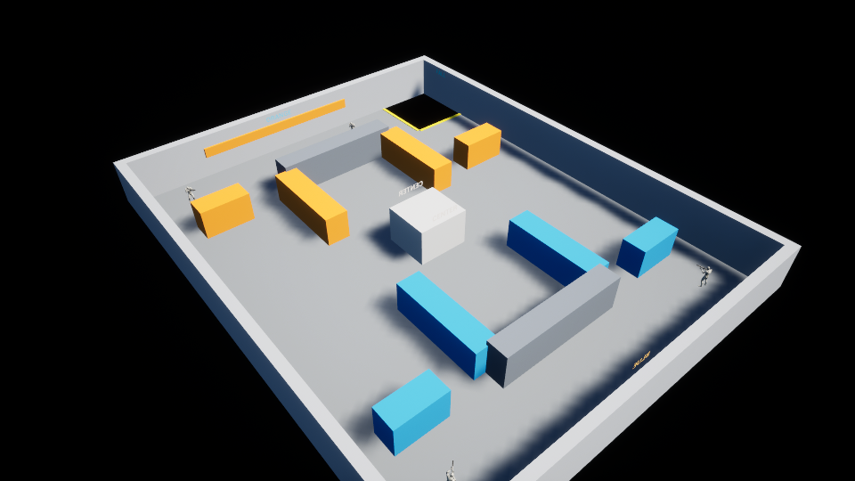
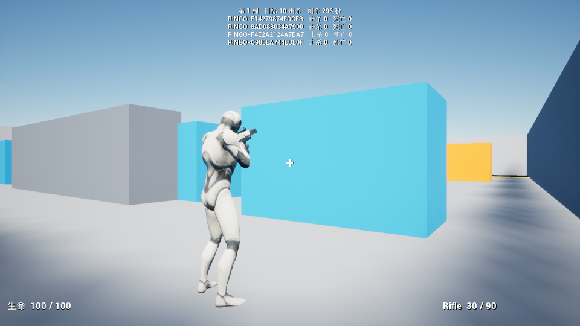
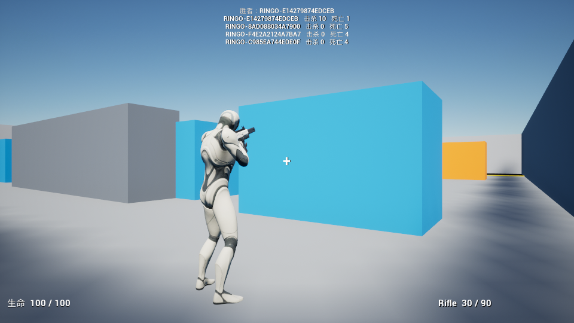
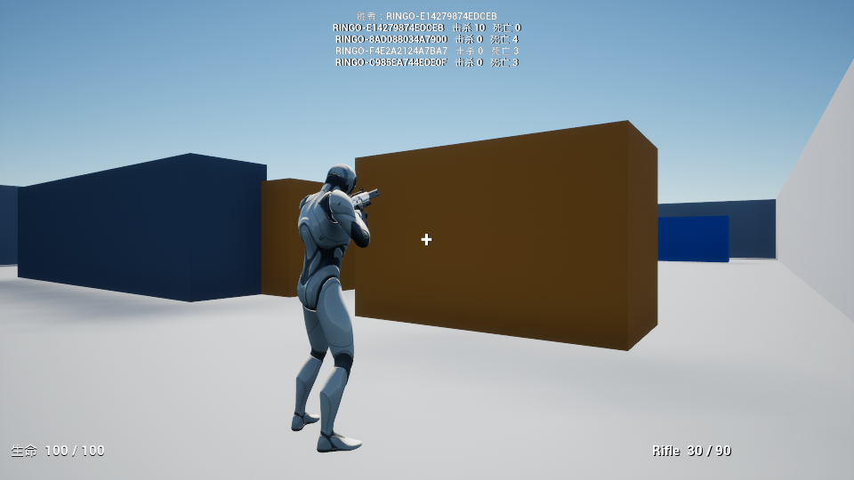

# 任务 23：独立灰盒竞技地图与跌落链

日期：2026-10-01。任务 22 基线：`6b566f6`。任务 23 的构建、资产、四进程运行与渲染验收已完成。

## 地图与装配

`/Game/Mini/Maps/L_MiniArena` 是独立的 40 × 32 米灰盒。平面三条通道、11 块掩体、8 个 PlayerStart、蓝／橙区域标识及中央地标，东北角有 6 × 5.5 米的黄色标记跌落区。碰撞使用 Engine Cube；7 个简单 DefaultLit 材质与动态太阳／天空光，不需要导入 Lyra 整套场景或安装新插件。

地图覆盖选择生产 `DA_MiniArenaExperience`，沿用共享 Combat ActionSet、PracticePawnData 和两把武器。Arena ActionSet 经 stock AddComponents 注入服务器 PhaseRules／MatchRules；训练 ActionSet 的靶与补给没有进入地图。游戏类不根据地图名称分支。

| 入口 | 地图覆盖 | 玩法组合 |
| --- | --- | --- |
| `L_MiniPractice` | `DA_MiniPracticeExperience` | MiniShooterCore，Combat + Practice |
| `L_MiniArena` | `DA_MiniArenaExperience` | MiniShooterCore + MiniArena，Combat + Arena |
| 未配置覆盖的地图 | 项目回退 Practice | 显式 DefaultExperienceId |

任务 23 的启动图保持 Practice；任务 24 才引入产品前端。两张玩法图现在都有显式 `MapsToCook`；最终资源白名单与新可分发包属于任务 28。旧任务 20 包不包含本次地图。

作者脚本只写竞技图与 `/Game/Mini/Maps/Materials/M_MiniArena_*`。`Task23ArenaLayout.json` 记录 Actor 标签、几何尺寸、出生朝向及材质；重复作者与独立验证均使用单独 Editor 进程，并核对训练图／已有 Experience 和 ActionSet 文件哈希未变。

## 跌落处理

竞技图开启世界边界检查，KillZ 为 -650 cm。`MiniCharacter::FellOutOfWorld` 将当前有效玩家交给服务器 GameMode。已死亡角色保留至既有生命重生工作处理；不再走 Engine 默认立即 Destroy 而丢失死亡结算。轻量 `CheckStillInWorld` 拦截硬世界边界的默认分离 Controller／关闭碰撞路径。

正常 Playing、无保护的跌落使用真实环境伤害 GE，沿用共同伤害门控、Health 死亡、Environment 归因与三秒重生。环境死亡只增加 Deaths，不增加 Kills。训练角色也走现有环境 GE／重生链，仍无竞技统计。

Warmup、PostMatch、出生保护及停止规则时被拒绝的伤害不转成死亡：选择有站立地面且胶囊无占用的出生点，Teleport 当前 Pawn。生命、生命值、分数和装备不改变，出生保护不续期。检查实际 Teleport 结果而非只检查请求坐标。

全部出生点占用时保存 0.5 秒恢复重试，暂时停止当前角色移动；每帧的 KillZ 回调不会重复伤害或重复创建工作。保存弱 Pawn／Controller／PlayerState／Match、LifeId、RoundId、generation 和 serial，重试重新核验。死亡、注销、UnPossessed、Pawn EndPlay、比赛取消／换局及 GM EndPlay 清理计时器；只归还本工作暂停的同一活生命，避免启动新 Pawn 或死 Pawn 的移动。

## 可复现操作

```powershell
.\Scripts\BuildProject.ps1 -Target FPSEditor -DisableAdaptiveUnity
.\Scripts\BuildProject.ps1 -Target FPS -DisableAdaptiveUnity
.\Scripts\Task23Assets.ps1
.\Scripts\VerifyTask23Production.ps1
.\Scripts\VerifyTask23.ps1
.\Scripts\VerifyTask23.ps1 -Mode Arena -WithMedia
```

普通生产启动脚本使用竞技地图，无 `Experience` URL 参数、无探针，检查单人等待与主机加三客户端加载。诊断脚本使用生产配置，驱动实际 GE 及 CharacterMovement KillZ 路径，而非直接调用跌落处理函数或写分数。

## 验收记录

| 实际检查 | 结果 |
| --- | --- |
| 最终 FPSEditor／FPS Development，`-DisableAdaptiveUnity` | PASS；两处旧 MovementBase API 改为 UE 5.8 新接口，最终构建无该弃用警告 |
| Create／CreateAgain／独立 Verify | PASS；三个独立 Editor 进程、0 errors／0 warnings，六个已有生产文件哈希保持 |
| 无探针、无 Experience URL 的普通竞技地图 | PASS；单人至少三秒继续无限 Warmup，主机＋三客户端加载地图覆盖的生产 Arena，Playing 为 300 秒 |
| 八个出生点地面／胶囊净空、三路实际 Sweep 与地面采样 | PASS；坑内真实无地板碰撞 |
| Warmup 跌落、八点全堵、共同取消入口、下一实际 Tick 新恢复、释放阻挡 | PASS；同 Pawn／Life／Health／分数／装备，取消释放本工作移动暂停，无重复工作 |
| 四人各一次无保护真实 KillZ | PASS；四次 Environment death，零 Kills，三秒新 Avatar 与两秒保护 |
| 保护内跌落及重复 Health 初始化 | PASS；返回同 Pawn，不增加死亡、不刷新保护时长 |
| 连续两局达分、两次 PostMatch 跌落、第三局清分 | PASS；20 次真实战斗 GE、两次四人冻结结算，第一局总死亡 14／第二局 10；第三局四个新生命，分数清零 |
| 每个客户端六次复制／Avatar／HUD／服务器时钟 checkpoint | PASS；`ArenaReady → EnvironmentDeaths → Result1 → Round2 → Result2 → Round3` |
| 默认训练地图及真实跌落重生 | PASS；三训练靶、环境 GE，三秒恢复且仍无 Arena／竞技 HUD／保护／统计 |
| 任务 10、任务 19、任务 22 Revoke 回归 | PASS；输入与三次重生、HUD／菜单／真实 Core 撤销、真实 Arena Action 撤销 |
| `-WithMedia` 四进程完整重跑 | PASS；四张实际 960 × 540 图片逐张复核，Playing、两局结果与总览保存于 Evidence |

连续开局暴露并修复了输入事件缺口：持久 PlayerState ASC 的旧 `State_Dead` 可能晚于新 Pawn 的初始化解除，第一次 Input 绑定被拒后没有再通知。Hero 现在只为当前活 Pawn 的这次等待保存死亡 Tag 监听，解除后重新执行既有绑定流程；解绑、ASC 替换与 EndPlay 释放句柄。实际运行记录 `MiniInput DEATH_TAG_CLEARED ... RetryBind=1`，随后上一局最后死亡的客户端正常确认 Round2／Round3；没有轮询或客户端删 Tag。

渲染进程初始化会改变客户端加入次序，脚本按实际服务器 OwnerIndex 查找截图。修复前的检查固定 Owner1 而误报缺图，修复后完整重跑 PASS；生产玩法没有为此修改。

证据：`Evidence/Task23-Arena-Server.txt`、`Task23-WithMedia-Arena-Server.txt`、`Task23-Practice-Server.txt`、`RenderedClient.txt`。原始运行日志在 `Saved/Logs/Task23-*.log`。普通生产日志使用 `Task23-Production-*`。









静态通道验收是实际胶囊 Sweep 与沿线地面采样，表示碰撞净空与有地面，不等于真人已经沿每条通道实走。两局诊断使用真实 GE 触发生产计分／死亡／重生，不等于已完成最终打包后的真人枪战验收。

## 后续边界

此图有少量工程灰盒素材，未承诺最终美术。最多四人的服务器批准、错误 IP 恢复、主机离开提示及前端入口属于任务 24；完整旅行／撤销生命周期属于任务 25。新恢复工作存在时的实际 Action 撤销／Logout／世界销毁，以及硬世界边界分支，仅完成代码审查，本次没有把它们写成已运行通过。尸体保留期间部分客户端有 UE `CreateSavedMove` 队列上限提示，输入能在重生恢复，移动网络收敛留任务 25／27。最终包与跨机器局域网证据仍待任务 28／29。
